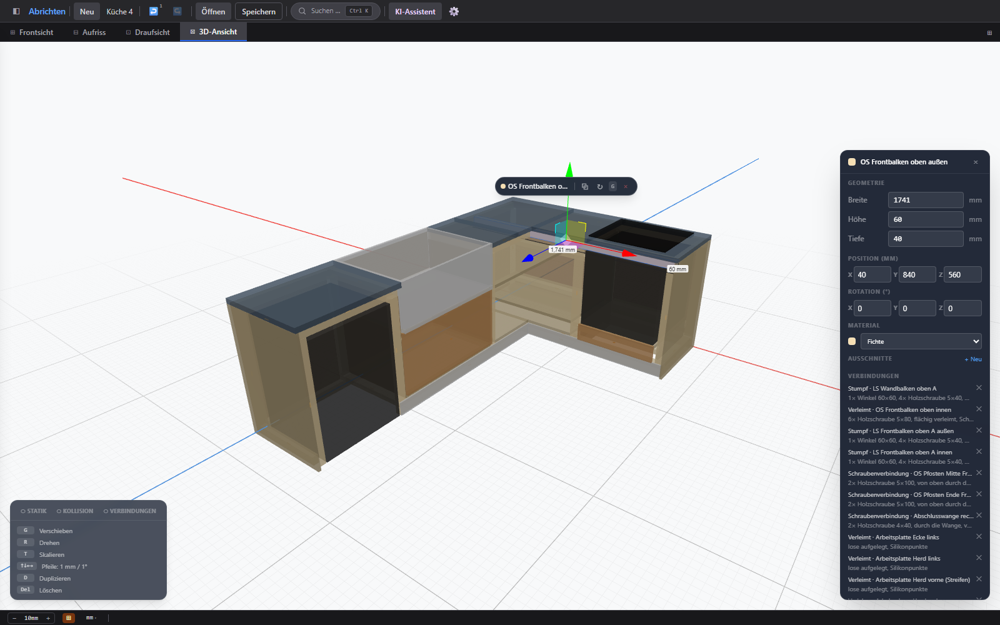

# Abrichten

Desktop application for planning furniture, shelving, and kitchen projects in wood and stone. Combines a full-screen 3D canvas with glass-card overlays, context-aware shortcuts, and AI-assisted sketch analysis.



*(regenerate with `npm run build && npm run screenshot [project.abrichten.json] [quad|3d] [board name]`; without a file the bundled sample project is used)*

## Features

### Canvas & Modelling
- **Single unified canvas** — one React Three Fiber scene, four camera modes (front, side, top, 3D)
- **Quad layout** — all four views side by side, toggled with the `⊞` button in the view tabs
- **Boards** — parametric rectangles with width × height × depth, material, grain direction, edge banding, rectangular cutouts (hob / sink openings, rendered as holes and exported as a DXF layer)
- **TransformControls gizmo** — translate / rotate in 3D view; pointer-drag in orthographic views
- **Zoom & pan** — scroll-wheel zoom around cursor, right-click drag to pan; state persisted per view
- **Snap to grid** — configurable step (mm), snap indicator pulses on hit
- **Assembly X-ray** — highlight one assembly and its edges show through everything else while the rest is ghosted; drag boards between assemblies in the tree

### Overlays (in-canvas glass cards)
- **FloatingPropertiesCard** — appears bottom-right when a board is selected; edit name, W×H×D, material, cutouts, duplicate, rotate 90°, delete; lists the board's joints with their fasteners and notes
- **ContextHUD** — always-visible bottom-left card with LED overlay toggles (Static / Collision / Joints) and context-sensitive shortcut hints
- **AssemblyDrawer** — slide-in panel (left edge) showing the assembly tree; toggle with `◧` button or `B` key
- **ChatPanel** — AI assistant as a fixed right-edge drawer

### Analysis & Engineering
- **Static analysis** — beam deflection with 20 % safety factor and the weight of stone resting on a member; stone must be supported, vertical members and members lying on the floor or on another member are not rated as beams; colour-coded overlay (green / amber / red)
- **Collision detection** — AABB overlap, highlighted in-canvas with collision box overlay
- **Joints & fasteners** — butt, miter, dado, rabbet, dowel, biscuit, screw, pocket screw, dovetail, lap and glued joints between any two boards, also across assemblies; each joint carries its fasteners (screws, dowels, angle brackets, joist hangers, staples) and a workshop note; markers in 3D, joint count badge per board, dado/rabbet grooves drawn on the host board
- **Dimension overlay** — staggered dimension lines with assembly total dims

### Panels (via ⌘K command palette)
- **Carcass generator** — build a full cabinet from outer dimensions in one step
- **Cutting list** — sortable table of all parts, grouping of identical parts, fastener summary (screws, brackets, staples by size), CSV and DXF export
- **Sheet nesting** — guillotine-optimised layout with SVG / DXF export
- **Shop drawings** — DXF/PDF workshop drawings per assembly
- **Cost calculator** — material + hardware cost breakdown with PDF export
- **Hardware catalogue** — Blum, Grass, Hettich fittings with quantity take-off
- **32 mm boring list** — system drilling pattern export for CNC
- **Drawer calculator** — Blum TANDEM, Grass Nova Pro, Hettich ArciTech sizing
- **Hinge calculator** — CLIP top / Sensys / Tiomos boring diagram + recommendation
- **Parameters panel** — named dimension references usable in formulas (`=H-18`)
- **Tolerance reference** — 10 standard clearances with nudge controls
- **Custom materials** — CRUD for project-specific materials with per-material pricing
- **Measurement tools** — point-to-point distance, angle, area with snap

### Workflow
- **Undo / Redo** — full history via zundo (Zustand temporal middleware)
- **Save / Load** — JSON project file via Electron file dialog (Ctrl+S / Ctrl+O)
- **Auto-save** — IndexedDB via Dexie on every project change
- **Onboarding** — first-launch welcome dialog with sample project
- **AI assistant** — upload a sketch or describe a piece; Claude / GPT via OpenRouter creates boards in one undo step
- **I18N** — German and English, switchable at runtime
- **Safe loading** — project files are validated and normalised on open; a malformed file is rejected with a message instead of breaking the scene
- **Error boundary** — a crashing panel shows the error with retry and reload buttons instead of a blank window
- **Sandboxed renderer** — Electron's default sandbox stays on; the preload exposes only the file dialogs

## Tech Stack

| Area | Technology |
|---|---|
| Desktop | Electron 40 |
| Build | electron-vite 5 + Vite 7 |
| Frontend | React 19 + TypeScript |
| Styling | TailwindCSS v4 |
| State | Zustand 5 + zundo (undo/redo) |
| 3D | React Three Fiber 9 + @react-three/drei 10 |
| Persistence | Dexie (IndexedDB) |
| I18N | i18next + react-i18next |
| AI | OpenRouter API (VLM / chat) |

## Requirements

- **Node.js** >= 18 (>= 23 for `npm run test:unit`, which imports TypeScript directly)
- **npm** >= 9

## Installation & Dev

```bash
git clone <repo-url>
cd abrichten
npm install

# optional: AI assistant config via env file
cp .env.example .env   # then add your OpenRouter API key

# development (hot-reload, Electron window opens automatically)
npm run dev

# production build
npm run build
```

`npm run dev` starts a Vite dev server on `localhost:5173` and opens the Electron window.

## Testing

End-to-end tests (Playwright) drive the built renderer in headless Chromium — no Electron needed:

```bash
npm run build            # tests run against the build output in out/renderer
npm test                 # run all E2E specs
npm run test:e2e:headed  # watch the browser while tests run
npm run test:unit        # node:test unit tests, no extra dependencies
```

The suite in `tests/e2e/` (57 tests in 19 spec files) covers boot, selection, keyboard shortcuts, undo/redo, gizmo drags (translate / resize / rotate), camera pan & zoom, view switching, marquee-vs-drag selection, cutouts, project-file validation with joint pruning, and every panel opening without a page error. The unit tests in `tests/unit/` check the board rotation math against Three.js.

## Project Structure

```
src/
├── main/               # Electron main process
│   └── index.ts
├── preload/            # Electron preload (exposes electronAPI)
│   └── index.ts
└── renderer/
    └── src/
        ├── components/
        │   ├── UnifiedCanvas.tsx     # Single R3F canvas hosting all views
        │   ├── CameraController.tsx  # Ortho + perspective cameras, zoom/pan
        │   ├── OrthoGrid.tsx         # Grid that follows the active view
        │   ├── ErrorBoundary.tsx     # Root error boundary (message instead of a blank window)
        │   ├── layout/     # Toolbar, StatusBar, AssemblyDrawer, CommandPalette, ViewTabs, QuadLayout, PanelHub, SettingsDialog
        │   ├── overlays/   # FloatingPropertiesCard, ContextHUD, gizmo handles, dimension/static/collision overlays
        │   ├── panels/     # CuttingList, NestingPanel, CostPanel, HardwarePanel, KorpusPanel, …
        │   ├── views3d/    # Board3D mesh with drag & transform logic
        │   ├── tools/      # MarqueeSelect, MeasureTools3D
        │   ├── ai/         # ChatPanel
        │   ├── onboarding/ # WelcomeDialog with sample project
        │   └── ui/         # ContextMenu
        ├── config/         # Env-based configuration (.env)
        ├── data/           # Materials, hardware catalogue, board presets
        ├── hooks/          # useKeyboard, useAutoSave, measurement hooks
        ├── i18n/           # de.json, en.json
        ├── services/       # Static calc, boring calc, OpenRouter client, IndexedDB storage, project file open
        ├── store/          # useProjectStore, useUIStore (Zustand)
        ├── types/          # TypeScript interfaces (Board, Assembly, Joint, …)
        └── utils/          # Units, collision, snap, DXF, nesting, projection, project validation, text escaping
tests/
├── e2e/                # Playwright specs, static server, drag/camera helpers
└── unit/               # node:test specs (import .ts directly)
```

## Keyboard Shortcuts

### Always

| Key | Action |
|---|---|
| `F` | Fit view |
| `S` | Toggle snap |
| `B` | Toggle assembly drawer |
| `Alt+G` | Toggle grid |
| `?` | Show all shortcuts |
| `Ctrl+K` | Command palette |
| `Esc` | Deselect / cancel |
| `Ctrl+Z` | Undo |
| `Ctrl+Shift+Z` | Redo |
| `Ctrl+O` | Open project |
| `Ctrl+S` | Save project |
| `1` – `4` | Select / Measure / Angle / Area tool |
| `Alt+1` – `Alt+4` | Front / Side / Top / 3D view |

### Board selected

| Key | Action |
|---|---|
| `D` | Duplicate (Ctrl+D also works) |
| `Delete` | Delete selected board(s) |
| `G` | Translate mode (3D) |
| `R` | Rotate mode (3D) |
| `T` | Scale mode (arrows resize along the view axes) |
| `J` | Create joint (requires 2 boards) |
| `↑ ↓ ← →` | Nudge 1 mm |
| `Shift + arrows` | Nudge 10 mm |
| `Ctrl+A` | Select all boards in assembly |

## Settings

Via the `⚙` button in the toolbar:

- **Language** — Deutsch / English
- **OpenRouter API key** — required for the AI assistant
- **VLM model** — model selection for image and chat analysis

Alternatively, configure the AI assistant via a `.env` file in the project root (see [.env.example](.env.example)): `VITE_OPENROUTER_API_KEY`, `VITE_OPENROUTER_MODEL`, and optionally `VITE_OPENROUTER_BASE_URL` for any OpenAI-compatible endpoint. Values from the Settings dialog take precedence. Note that Vite inlines env values at build time, so don't ship a production build made with a real key in `.env`.

## License

MIT — see [LICENSE](LICENSE)
